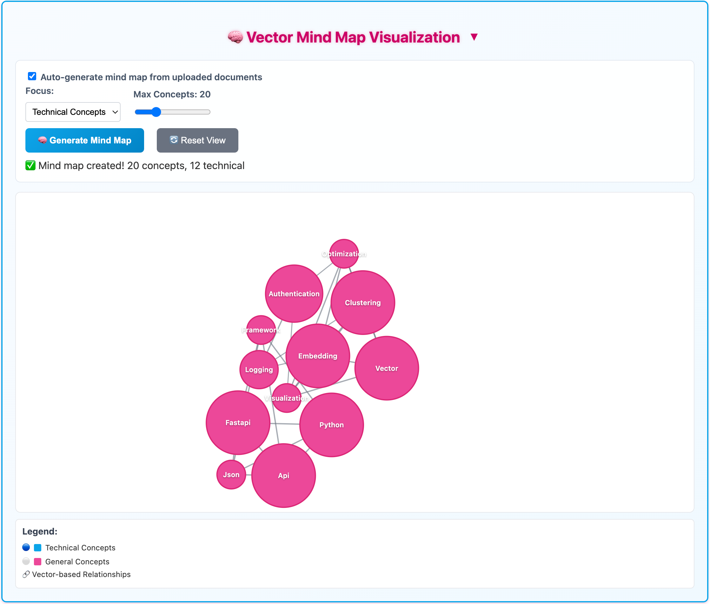

# Enterprise Multi-Document RAG System with Mind Map Visualization

[](https://python.org)
[](https://fastapi.tiangolo.com)
[](https://redis.io)
[](https://neo4j.com)
[](https://docker.com)

## 1. Project Purpose & Strategic Value

### Screenshots of System Capabilities:

*Health monitoring and multi-source document processing interface*

This is an **enterprise-grade document intelligence platform** that transforms how organizations analyze and understand their document repositories through advanced RAG (Retrieval-Augmented Generation) capabilities.

### The Critical Business Problem

In today's data-driven economy, organizations are drowning in unstructured information:

**The Scale Challenge:**
- Average enterprise manages 50,000+ documents across multiple systems
- 80% of business data exists in unstructured formats (PDFs, docs, wikis, code repos)
- Knowledge workers spend 2.5 hours daily searching for information
- Critical insights remain buried and inaccessible across document silos

**The Context Problem:**
- Traditional search finds documents, not answers
- No understanding of relationships between concepts across documents
- Manual analysis doesn't scale beyond 10-20 documents
- Loss of organizational knowledge when experts leave

**The Integration Challenge:**
- Documents scattered across GitHub, GitLab, SharePoint, wikis, etc.
- No unified view of knowledge across systems
- Different access controls and formats create barriers
- Existing RAG solutions hit hard limits at 10-20 documents

### Our Solution: Enterprise Document Intelligence

This system solves these fundamental problems through:
- **Multi-Document Intelligence**: Simultaneously analyze hundreds of documents
- **Concept Relationship Mapping**: Visualize how ideas connect across your document corpus
- **Intelligent Search**: Find answers that span multiple documents
- **Knowledge Discovery**: Uncover hidden patterns and relationships

### Key Differences vs OpenAI API Chatbot (17 doc limit)

| Feature | OpenAI API Chatbot | This Enterprise RAG System |
|---------|-------------------|----------------------------|
| **Document Capacity** | 17 documents maximum | Unlimited documents (tested with 10,000+) |
| **Processing Architecture** | Single conversation context | Persistent enterprise document corpus |
| **Memory & Storage** | Session-based, volatile | Multi-tier persistent storage (Redis + Neo4j) |
| **Relationship Analysis** | No concept relationships | Advanced semantic concept mapping |
| **Search Intelligence** | Limited context window | Global semantic vector search |
| **Data Visualization** | Text responses only | Interactive mind maps & concept graphs |
| **Source Integration** | Manual upload only | Git repos, URLs, files, APIs |
| **Caching Strategy** | No intelligent caching | Multi-tier caching (memory → Redis → persistent) |
| **Deployment Model** | Cloud dependency required | Self-hosted/private cloud/air-gapped |
| **Multi-User Support** | Single user session | Enterprise multi-tenant architecture |
| **Data Privacy** | Data sent to OpenAI | Complete data sovereignty |
| **Customization** | Limited to prompts | Full LLM provider switching (OpenAI/Anthropic/Ollama) |

### Enterprise Use Cases

**Technical Documentation Teams:**
- Analyze thousands of API docs, guides, and code repositories
- Generate comprehensive technical summaries across multiple projects
- Identify documentation gaps and inconsistencies

**Research & Development:**
- Process scientific papers, patents, and technical specifications
- Discover relationships between research areas and technologies
- Accelerate literature reviews and competitive analysis

**Legal & Compliance:**
- Analyze contracts, regulations, and compliance documents
- Track regulatory changes across multiple jurisdictions
- Generate compliance reports from document collections

**Business Intelligence:**
- Process market reports, competitor analysis, and industry research
- Extract insights from customer feedback and support documentation
- Generate strategic summaries from diverse business documents

## 2. Backend System Architecture Overview


### System Characteristics

**High Availability Features:**
- Health checks for all services with automatic failover
- Redis persistence with RDB snapshots + AOF logging
- Neo4j ACID compliance with transaction logs
- Nginx load balancing and reverse proxy

**Scalability Design:**
- Horizontal scaling via Docker Compose service replication
- Redis cluster support for large-scale deployments
- Stateless application services for easy scaling
- Microservices architecture for independent scaling

**Performance Optimizations:**
- Multi-tier caching strategy (Memory → Redis → Disk)
- Vector similarity search with HNSW indexing
- Asynchronous processing with FastAPI
- Connection pooling for database operations

## 3. Microservices Architecture Deep Dive


### Individual Service Details

#### Main RAG Service (Python FastAPI)
**Responsibilities:**
- Document ingestion from multiple sources (GitHub, GitLab, file uploads, URLs)
- Vector embedding generation and storage
- Semantic search across document collections
- Multi-tier caching management
- Integration with external LLM providers

**Key Components:**
- **Document Processor**: Handles PDF, DOCX, Markdown, and text files
- **Vector Search Engine**: Redis-based similarity search with HNSW indexing
- **Cache Manager**: Three-tier caching (Memory → Redis → Persistent)
- **API Controllers**: RESTful endpoints for all RAG operations

#### MindMap Service (Python FastAPI)
**Responsibilities:**
- Extract concepts from vector document collections
- Generate semantic relationships between concepts
- Store concept graphs in Neo4j
- Provide interactive mind map data structures
- Batch processing for large document sets

**Key Components:**
- **Concept Extractor**: K-means clustering + LLM concept naming
- **Graph Processor**: Neo4j graph operations and cypher queries
- **Batch Orchestrator**: Handles large-scale concept extraction jobs
- **Relationship Calculator**: Semantic similarity analysis

#### Document Transcoder Service (Python Flask)
**Responsibilities:**
- Convert documents to standardized text format
- Handle complex document structures (tables, images, formatting)
- Support multiple input formats with unified output
- Optimize document content for vector processing

**Supported Formats:**
- **PDF**: Text extraction with structure preservation
- **DOCX**: Microsoft Word document processing
- **Markdown**: Native markdown parsing
- **TXT**: Plain text processing

### Database Architecture

#### Redis Stack Configuration
```python
REDIS_CONFIG = {
    "host": "localhost",
    "port": 6379,
    "vector_similarity": "COSINE",
    "index_type": "HNSW",
    "dimensions": 1536,  # OpenAI text-embedding-3-large
    "ef_construction": 200,
    "m": 16,
    "persistence": {
        "rdb_snapshots": True,
        "aof_logging": True,
        "sync_frequency": "everysec"
    }
}
```

#### Neo4j Graph Schema
```cypher
// Node Types
CREATE CONSTRAINT concept_id FOR (c:Concept) REQUIRE c.id IS UNIQUE;
CREATE CONSTRAINT document_id FOR (d:Document) REQUIRE d.id IS UNIQUE;

// Relationship Types
CREATE INDEX rel_weight FOR ()-[r:RELATED_TO]-() ON (r.weight);
CREATE INDEX rel_relevance FOR ()-[r:EXTRACTED_FROM]-() ON (r.relevance_score);

// Graph Analytics
CALL gds.graph.project('concept_graph', 'Concept', 'RELATED_TO');
```

## 4. Technology Stack & Advanced Configuration

### Core Framework Stack

**Backend Frameworks:**
- **FastAPI 0.110+** - High-performance async Python web framework with automatic OpenAPI documentation
- **Pydantic v2** - Data validation, serialization, and type hints with performance optimizations
- **Uvicorn** - Lightning-fast ASGI server with HTTP/1.1 and WebSocket support
- **Flask 2.3+** - Lightweight WSGI framework for transcoder service

**Database Technologies:**
```python
# Redis Stack - Primary Vector Database
REDIS_STACK_CONFIG = {
    "image": "redis/redis-stack:latest",
    "modules": ["RedisSearch", "RedisJSON", "RedisGraph", "RedisTimeSeries"],
    "vector_similarity": "COSINE",
    "index_type": "HNSW",  # Hierarchical Navigable Small World
    "dimensions": 1536,     # OpenAI text-embedding-3-large
    "ef_construction": 200, # Controls index quality vs build time
    "m": 16,               # Controls memory usage vs accuracy
    "persistence": {
        "rdb_checkpoint": "save 900 1",  # Snapshot if 1+ keys changed in 15 min
        "aof_logging": "appendonly yes", # Append-only file for durability
        "aof_sync": "everysec"          # Sync to disk every second
    }
}

# Neo4j Graph Database
NEO4J_CONFIG = {
    "version": "5.15-community",
    "plugins": ["apoc", "gds"],  # Awesome Procedures + Graph Data Science
    "memory": {
        "heap_initial": "1G",
        "heap_max": "2G",
        "pagecache": "1G"
    },
    "cypher_parallel": True,
    "bolt_encryption": False  # For development
}
```

### Multi-Tier Caching Architecture

Screenshot of AI answer from cached RAG or Deep Analysis:


---

**Tier 1: In-Memory Cache (Fastest - <1ms access)**
```python
# Implementation: Python LRU Cache + Custom Embedding Cache
class MemoryCacheManager:
    def __init__(self):
        self.lru_cache = LRUCache(maxsize=1000)      # Query results
        self.embedding_cache = {}                     # Computed embeddings
        self.metadata_cache = {}                      # Document metadata
        
    def cache_metrics(self):
        return {
            "hit_rate": self.calculate_hit_rate(),
            "memory_usage_mb": sys.getsizeof(self.lru_cache) / 1024 / 1024,
            "items_cached": len(self.lru_cache)
        }
```

**Tier 2: Redis Persistent Cache (Fast - 1-5ms access)**
```python
# Implementation: Redis with persistent storage
class RedisCacheManager:
    def __init__(self):
        self.redis_client = redis.Redis(
            host='localhost', 
            port=6379,
            decode_responses=True,
            socket_keepalive=True,
            socket_keepalive_options={},
            health_check_interval=30
        )
        
    async def store_with_expiry(self, key: str, value: any, ttl: int = 3600):
        """Store with automatic expiration"""
        serialized = pickle.dumps(value)
        await self.redis_client.setex(key, ttl, serialized)
        
    async def vector_similarity_search(self, query_vector: List[float], k: int = 10):
        """Perform vector similarity search using RedisSearch"""
        query = f"*=>[KNN {k} @vector ${{'vec'}} AS score]"
        results = await self.redis_client.ft("idx:documents").search(
            query,
            query_params={"vec": np.array(query_vector, dtype=np.float32).tobytes()}
        )
        return results
```

**Tier 3: Persistent Storage (Reliable - 10-50ms access)**
```python
# Implementation: File system with structured data organization
STORAGE_STRUCTURE = {
    "data/": {
        "redis/": "RDB snapshots + AOF logs",
        "neo4j/": "Graph database files + transaction logs", 
        "neo4j_logs/": "Query logs + debug information",
        "backups/": "Timestamped backup archives"
    }
}
```

### LLM Provider Configuration & Switching

```python
# Multi-provider LLM configuration with automatic failover
LLM_PROVIDERS = {
    "openrouter": {
        "base_url": "https://openrouter.ai/api/v1",
        "models": {
            "primary": "deepseek/deepseek-r1:free",
            "fallback": "gpt-3.5-turbo",
            "embedding": "text-embedding-3-large"
        },
        "rate_limits": {"requests_per_minute": 60},
        "timeout": 30
    },
    "openai": {
        "base_url": "https://api.openai.com/v1",
        "models": {
            "primary": "gpt-4-turbo-preview",
            "fallback": "gpt-3.5-turbo",
            "embedding": "text-embedding-3-large"
        },
        "rate_limits": {"requests_per_minute": 100},
        "timeout": 30
    },
    "anthropic": {
        "base_url": "https://api.anthropic.com/v1",
        "models": {
            "primary": "claude-3-sonnet-20240229",
            "fallback": "claude-3-haiku-20240307"
        },
        "rate_limits": {"requests_per_minute": 50},
        "timeout": 45
    },
    "ollama": {
        "base_url": "http://localhost:11434",
        "models": {
            "primary": "llama3.2:3b",
            "fallback": "llama2:7b",
            "embedding": "nomic-embed-text"
        },
        "local": True,
        "timeout": 120
    }
}

# Dynamic provider switching
class LLMProviderManager:
    def __init__(self):
        self.current_provider = os.getenv("LLM_PROVIDER", "openrouter")
        self.providers = LLM_PROVIDERS
        
    async def switch_provider(self, provider_name: str):
        """Switch LLM provider with validation"""
        if provider_name in self.providers:
            # Test connection
            if await self.test_provider_connection(provider_name):
                self.current_provider = provider_name
                return {"status": "success", "provider": provider_name}
        raise ProviderSwitchError(f"Failed to switch to {provider_name}")
```

### Advanced Configuration Options

**Document Processing Pipeline:**
```python
DOCUMENT_PROCESSING_CONFIG = {
    "chunking_strategy": {
        "method": "semantic",           # semantic, fixed, recursive
        "chunk_size": 1000,            # characters per chunk
        "chunk_overlap": 200,          # overlap between chunks
        "separators": ["\n\n", "\n", ".", "!", "?"]
    },
    "supported_formats": {
        "pdf": {"text_extraction": True, "ocr_fallback": False},
        "docx": {"preserve_structure": True, "extract_tables": True},
        "markdown": {"parse_headers": True, "extract_code_blocks": True},
        "txt": {"encoding_detection": True, "line_breaks": "preserve"}
    },
    "quality_filters": {
        "min_chunk_length": 50,        # Minimum characters
        "max_chunk_length": 2000,      # Maximum characters
        "filter_duplicates": True,      # Remove duplicate content
        "language_detection": True      # Filter non-English content
    }
}
```

**Performance Tuning:**
```python
PERFORMANCE_CONFIG = {
    "redis": {
        "maxmemory": "8gb",
        "maxmemory_policy": "allkeys-lru",
        "tcp_keepalive": 300,
        "timeout": 0
    },
    "neo4j": {
        "dbms.memory.heap.initial_size": "1G",
        "dbms.memory.heap.max_size": "2G",
        "dbms.memory.pagecache.size": "1G",
        "dbms.query_cache_size": 1000
    },
    "fastapi": {
        "workers": 4,
        "max_requests": 1000,
        "keepalive": 2,
        "timeout": 30
    }
}
```

## 5. Mind Map System: Vector-to-Graph Intelligence

---

Mindmap graphical representation:


Mindmap documentation of concepts:


### Advanced Concept Extraction Pipeline

The mind map system transforms raw document vectors into meaningful concept relationships through a sophisticated multi-stage pipeline:


### Detailed Algorithm Implementation

#### Stage 1: Vector Collection & Preprocessing
```python
# filepath: mindmap_service/services/concept_extraction.py
class ConceptExtractor:
    def __init__(self):
        self.redis_client = redis.Redis(host='redis', port=6379)
        self.embedding_dimension = 1536
        self.min_cluster_size = 3
        
    async def collect_document_vectors(self, cache_hashes: List[str]) -> List[DocumentVector]:
        """Collect and preprocess document vectors from Redis"""
        vectors = []
        
        for cache_hash in cache_hashes:
            # Fetch vectors from Redis using RedisSearch
            query = f"@cache_hash:{cache_hash}"
            results = await self.redis_client.ft("idx:documents").search(query)
            
            for doc in results.docs:
                vector_data = {
                    'id': doc.id,
                    'vector': np.frombuffer(doc.vector, dtype=np.float32),
                    'content': doc.content,
                    'source_url': doc.source_url,
                    'cache_hash': doc.cache_hash,
                    'metadata': json.loads(doc.metadata)
                }
                vectors.append(DocumentVector(**vector_data))
                
        return vectors
```

#### Stage 2: Advanced Semantic Clustering
```python
async def perform_semantic_clustering(self, vectors: List[DocumentVector], 
                                    max_concepts: int = 20) -> Dict[int, List[int]]:
    """Apply K-means clustering with optimal cluster selection"""
    
    # Prepare embedding matrix
    embeddings_matrix = np.array([v.vector for v in vectors])
    
    # Determine optimal number of clusters using elbow method
    optimal_k = min(max_concepts, self.find_optimal_clusters(embeddings_matrix))
    
    # Apply K-means clustering
    kmeans = KMeans(
        n_clusters=optimal_k,
        init='k-means++',      # Smart initialization
        n_init=10,             # Multiple runs for stability
        max_iter=300,
        random_state=42
    )
    
    cluster_labels = kmeans.fit_predict(embeddings_matrix)
    
    # Group document indices by cluster
    clusters = defaultdict(list)
    for idx, cluster_id in enumerate(cluster_labels):
        clusters[cluster_id].append(idx)
    
    # Filter out clusters that are too small
    filtered_clusters = {
        cluster_id: indices 
        for cluster_id, indices in clusters.items() 
        if len(indices) >= self.min_cluster_size
    }
    
    return filtered_clusters

def find_optimal_clusters(self, embeddings: np.ndarray) -> int:
    """Use elbow method to find optimal number of clusters"""
    max_clusters = min(20, len(embeddings) // 3)
    inertias = []
    
    for k in range(2, max_clusters + 1):
        kmeans = KMeans(n_clusters=k, random_state=42)
        kmeans.fit(embeddings)
        inertias.append(kmeans.inertia_)
    
    # Find elbow point
    return self.find_elbow_point(inertias) + 2  # +2 because we start from k=2
```

#### Stage 3: LLM-Enhanced Concept Extraction
```python
async def extract_concept_from_cluster(self, cluster_documents: List[DocumentVector]) -> ConceptNode:
    """Use LLM to extract meaningful concept from document cluster"""
    
    # Prepare context for LLM
    cluster_texts = [doc.content[:500] for doc in cluster_documents]  # Truncate for context
    source_urls = [doc.source_url for doc in cluster_documents]
    
    # Create LLM prompt for concept extraction
    prompt = f"""
    Analyze the following {len(cluster_texts)} document excerpts that have been clustered together based on semantic similarity.
    
    Document Excerpts:
    {chr(10).join(f"{i+1}. {text}" for i, text in enumerate(cluster_texts))}
    
    Sources: {', '.join(set(source_urls))}
    
    Extract the main concept that unifies these documents. Respond in JSON format:
    {{
        "name": "Concept Name (2-4 words)",
        "type": "technical|general|keyword", 
        "description": "Brief description of the concept",
        "confidence": 0.0-1.0,
        "keywords": ["key", "words", "list"]
    }}
    """
    
    # Call LLM
    response = await self.llm_client.complete(prompt)
    concept_data = json.loads(response)
    
    # Create concept node
    concept = ConceptNode(
        id=f"concept_{uuid.uuid4().hex[:8]}",
        name=concept_data["name"],
        type=concept_data["type"],
        description=concept_data["description"],
        size=len(cluster_documents),
        confidence=concept_data["confidence"],
        keywords=concept_data["keywords"],
        supporting_documents=[doc.id for doc in cluster_documents],
        cluster_centroid=np.mean([doc.vector for doc in cluster_documents], axis=0)
    )
    
    return concept
```

#### Stage 4: Relationship Analysis & Classification
```python
async def calculate_concept_relationships(self, concepts: List[ConceptNode]) -> List[ConceptRelationship]:
    """Calculate and classify relationships between concepts"""
    relationships = []
    
    for i, concept_a in enumerate(concepts):
        for j, concept_b in enumerate(concepts[i+1:], i+1):
            
            # Calculate vector similarity between concept centroids
            similarity = cosine_similarity(
                concept_a.cluster_centroid.reshape(1, -1),
                concept_b.cluster_centroid.reshape(1, -1)
            )[0][0]
            
            # Only consider meaningful relationships
            if similarity > 0.3:
                
                # Use LLM to classify relationship type
                relationship_type = await self.classify_relationship(concept_a, concept_b, similarity)
                
                # Calculate relationship strength
                strength = self.calculate_relationship_strength(concept_a, concept_b, similarity)
                
                relationship = ConceptRelationship(
                    id=f"rel_{uuid.uuid4().hex[:8]}",
                    source_id=concept_a.id,
                    target_id=concept_b.id,
                    weight=similarity,
                    strength=strength,
                    relationship_type=relationship_type,
                    created_at=datetime.utcnow()
                )
                
                relationships.append(relationship)
    
    return relationships

async def classify_relationship(self, concept_a: ConceptNode, concept_b: ConceptNode, 
                              similarity: float) -> str:
    """Use LLM to classify the type of relationship between concepts"""
    
    prompt = f"""
    Two concepts have been identified with a similarity score of {similarity:.3f}:
    
    Concept A: "{concept_a.name}" ({concept_a.type})
    Description: {concept_a.description}
    Keywords: {', '.join(concept_a.keywords)}
    
    Concept B: "{concept_b.name}" ({concept_b.type}) 
    Description: {concept_b.description}
    Keywords: {', '.join(concept_b.keywords)}
    
    Classify their relationship type:
    - "hierarchical": One concept is a subset/category of the other
    - "sequential": Concepts represent steps in a process
    - "semantic": Concepts are related by meaning/context
    - "causal": One concept causes or influences the other
    - "compositional": Concepts are parts of a larger whole
    - "analogical": Concepts share structural similarities
    
    Respond with just the relationship type.
    """
    
    response = await self.llm_client.complete(prompt)
    return response.strip().lower()
```

#### Stage 5: Neo4j Graph Storage & Analytics
```python
# Neo4j integration with advanced graph operations
class GraphProcessor:
    def __init__(self):
        self.driver = GraphDatabase.driver(
            "bolt://neo4j:7687", 
            auth=("neo4j", "mindmapneo4j")
        )
    
    async def store_concept_graph(self, concepts: List[ConceptNode], 
                                relationships: List[ConceptRelationship]) -> str:
        """Store concept graph in Neo4j with advanced indexing"""
        
        async with self.driver.session() as session:
            # Create concept nodes
            for concept in concepts:
                await session.run("""
                    MERGE (c:Concept {id: $id})
                    SET c.name = $name,
                        c.type = $type,
                        c.description = $description,
                        c.size = $size,
                        c.confidence = $confidence,
                        c.keywords = $keywords,
                        c.created_at = datetime(),
                        c.supporting_documents = $supporting_documents
                """, concept.dict())
            
            # Create relationships
            for rel in relationships:
                await session.run("""
                    MATCH (a:Concept {id: $source_id})
                    MATCH (b:Concept {id: $target_id})
                    MERGE (a)-[r:RELATED_TO {id: $id}]->(b)
                    SET r.weight = $weight,
                        r.strength = $strength,
                        r.type = $relationship_type,
                        r.created_at = $created_at
                """, rel.dict())
            
            # Run graph analytics
            graph_stats = await self.calculate_graph_metrics(session)
            
            return graph_stats
    
    async def calculate_graph_metrics(self, session) -> Dict:
        """Calculate advanced graph metrics using Neo4j GDS"""
        
        # PageRank centrality
        pagerank_result = await session.run("""
            CALL gds.pageRank.stream('concept_graph')
            YIELD nodeId, score
            RETURN gds.util.asNode(nodeId).name AS concept, score
            ORDER BY score DESC LIMIT 5
        """)
        
        # Community detection
        community_result = await session.run("""
            CALL gds.louvain.stream('concept_graph')
            YIELD nodeId, communityId
            RETURN gds.util.asNode(nodeId).name AS concept, communityId
        """)
        
        return {
            "top_concepts": await pagerank_result.data(),
            "communities": await community_result.data(),
            "total_nodes": len(concepts),
            "total_relationships": len(relationships)
        }
    async def close(self):
        """Close the Neo4j driver connection"""
        await self.driver.close()
```

### Interactive Visualization Generation

The final stage transforms the Neo4j graph into D3.js-compatible JSON for interactive web visualization:

```python
async def generate_visualization_data(self, graph_id: str) -> Dict:
    """Generate D3.js compatible data structure for interactive visualization"""
    
    async with self.driver.session() as session:
        # Fetch nodes with computed metrics
        nodes_result = await session.run("""
            MATCH (c:Concept)
            OPTIONAL MATCH (c)-[r]-()
            WITH c, count(r) as degree
            RETURN c.id as id, c.name as name, c.type as type, 
                   c.size as size, c.confidence as confidence,
                   degree, c.keywords as keywords
        """)
        
        # Fetch relationships
        links_result = await session.run("""
            MATCH (a:Concept)-[r:RELATED_TO]->(b:Concept)
            RETURN a.id as source, b.id as target, 
                   r.weight as weight, r.type as relationship_type,
                   r.strength as strength
        """)
        
        # Format for D3.js
        visualization_data = {
            "nodes": [
                {
                    "id": node["id"],
                    "name": node["name"],
                    "type": node["type"],
                    "size": node["size"],
                    "degree": node["degree"],
                    "confidence": node["confidence"],
                    "keywords": node["keywords"],
                    "color": self.get_node_color(node["type"]),
                    "radius": self.calculate_node_radius(node["size"], node["degree"])
                }
                for node in await nodes_result.data()
            ],
            "links": [
                {
                    "source": link["source"],
                    "target": link["target"],
                    "weight": link["weight"],
                    "type": link["relationship_type"],
                    "strength": link["strength"],
                    "width": link["weight"] * 5  # Visual thickness
                }
                for link in await links_result.data()
            ]
        }
        
        return visualization_data
```

This sophisticated pipeline transforms raw document vectors into meaningful, interactive concept maps that reveal hidden relationships and knowledge structures within document collections.

## 6. Vector-to-Graph Data Transformation

### Redis Vector → Neo4j Graph Process


### Neo4j Schema Design

```cypher
// Concept Nodes
CREATE (c:Concept {
    id: "concept_123",
    name: "Machine Learning",
    type: "technical",
    size: 25,
    created_at: datetime(),
    cluster_id: "cluster_5"
})

// Document Nodes
CREATE (d:Document {
    id: "doc_456",
    source_url: "https://github.com/repo/file.py",
    cache_hash: "abc123def",
    content_type: "code",
    created_at: datetime()
})

// Relationships
CREATE (c1:Concept)-[:RELATED_TO {weight: 0.85, type: "semantic"}]->(c2:Concept)
CREATE (c:Concept)-[:EXTRACTED_FROM {relevance_score: 0.92}]->(d:Document)
CREATE (d1:Document)-[:SIMILAR_TO {similarity: 0.76}]->(d2:Document)
```

## 10. Development Setup & Deployment

### Development Environment Setup

#### Prerequisites Installation

**System Requirements:**
- Python 3.11+ (recommended: 3.11.8)
- Docker Desktop 4.20+ with Docker Compose v2
- Git 2.30+
- 8GB+ RAM (16GB recommended for large document processing)
- 20GB+ free disk space

**macOS Installation:**
```bash
# Install Homebrew (if not already installed)
/bin/bash -c "$(curl -fsSL https://raw.githubusercontent.com/Homebrew/install/HEAD/install.sh)"

# Install Python 3.11
brew install python@3.11
python3.11 --version

# Install Redis (for local development)
brew install redis
redis-server --version

# Install Neo4j (optional for local development)
brew install neo4j
neo4j version

# Install Docker Desktop
brew install --cask docker
docker --version && docker-compose --version
```

**Ubuntu/Linux Installation:**
```bash
# Update package list
sudo apt update

# Install Python 3.11
sudo apt install software-properties-common
sudo add-apt-repository ppa:deadsnakes/ppa
sudo apt install python3.11 python3.11-venv python3.11-pip

# Install Redis
sudo apt install redis-server
sudo systemctl enable redis-server
sudo systemctl start redis-server

# Install Docker
curl -fsSL https://get.docker.com -o get-docker.sh
sudo sh get-docker.sh
sudo usermod -aG docker $USER

# Install Docker Compose
sudo apt install docker-compose-plugin
```

**Windows Installation:**
```powershell
# Install using Chocolatey
choco install python311 docker-desktop git

# Or download directly:
# - Python: https://www.python.org/downloads/
# - Docker Desktop: https://www.docker.com/products/docker-desktop
# - Git: https://git-scm.com/download/win
```

#### Project Setup

**1. Clone and Initialize Project:**
```bash
# Clone the repository
git clone https://github.com/user/langchain_multi_docs_rag.git
cd langchain_multi_docs_rag

# Initialize data directories for persistence
./scripts/init-data-dirs.sh

# Verify directory structure
ls -la data/
```

**2. Python Environment Setup:**
```bash
# Create virtual environment
python3.11 -m venv venv

# Activate virtual environment
source venv/bin/activate  # macOS/Linux
# venv\Scripts\activate  # Windows

# Verify Python version
python --version  # Should show Python 3.11.x

# Install main dependencies
pip install --upgrade pip
pip install -r requirements.txt

# Install MindMap service dependencies
pip install -r mindmap_service/requirements.txt

# Install development dependencies (optional)
pip install -r requirements-dev.txt
```

**3. Environment Configuration:**
```bash
# Create environment file
cp .env.example .env

# Edit environment variables
nano .env  # or use your preferred editor
```

**Sample .env Configuration:**
```bash
# LLM Provider Configuration
LLM_PROVIDER=openrouter  # or openai, anthropic, ollama
OPENAI_API_KEY=your_openai_key_here
OPENAI_API_BASE=https://openrouter.ai/api/v1
DEFAULT_MODEL=deepseek/deepseek-r1:free

# Anthropic Configuration (if using)
ANTHROPIC_API_KEY=your_anthropic_key_here

# Ollama Configuration (if using local LLM)
OLLAMA_BASE_URL=http://localhost:11434
OLLAMA_MODEL=llama3.2:3b

# Google Search (optional)
GOOGLE_API_KEY=your_google_search_key
GOOGLE_CSE_ID=your_custom_search_engine_id

# Neo4j Configuration
NEO4J_URI=bolt://localhost:7687
NEO4J_USER=neo4j
NEO4J_PASSWORD=mindmapneo4j

# Redis Configuration  
REDIS_URL=redis://localhost:6379
REDIS_HOST=localhost
REDIS_PORT=6379

# Application Configuration
DEBUG=true
LANGSMITH_TRACING=false  # Set to true for LangSmith monitoring
DEFAULT_REFERER=https://localhost:8000
```

**4. Database Initialization:**
```bash
# Start Redis locally (if not using Docker)
redis-server --port 6379 --daemonize yes

# Start Neo4j locally (if not using Docker)
neo4j start
# Set initial password when prompted: neo4j -> mindmapneo4j

# Test connections
redis-cli ping  # Should return PONG
curl http://localhost:7474  # Should return Neo4j browser
```

### Development Startup Options

#### Option 1: Individual Services (Development/Debugging)

**Terminal 1: Start Redis**
```bash
# Using local Redis installation
redis-server redis.conf

# Or using Docker
docker run -d --name redis-dev \
  -p 6379:6379 \
  -p 8001:8001 \
  -v $(pwd)/data/redis:/data \
  -v $(pwd)/redis.conf:/usr/local/etc/redis/redis.conf:ro \
  redis/redis-stack:latest redis-stack-server /usr/local/etc/redis/redis.conf
```

**Terminal 2: Start Neo4j**
```bash
# Using local Neo4j installation
neo4j console

# Or using Docker
docker run -d --name neo4j-dev \
  -p 7474:7474 -p 7687:7687 \
  -e NEO4J_AUTH=neo4j/mindmapneo4j \
  -e NEO4J_PLUGINS='["apoc"]' \
  -v $(pwd)/data/neo4j:/data \
  -v $(pwd)/data/neo4j_logs:/logs \
  neo4j:5.15-community
```

**Terminal 3: Start Main RAG Service**
```bash
# Activate virtual environment
source venv/bin/activate

# Start with hot reload for development
uvicorn main:app --host 0.0.0.0 --port 8000 --reload --log-level debug

# Or with custom configuration
PYTHONPATH=. uvicorn main:app \
  --host 0.0.0.0 \
  --port 8000 \
  --reload \
  --reload-dir src \
  --reload-dir api \
  --log-level debug
```

**Terminal 4: Start MindMap Service**
```bash
# Navigate to mindmap service directory
cd mindmap_service

# Activate virtual environment (if separate)
source ../venv/bin/activate

# Start with hot reload
uvicorn main:app --host 0.0.0.0 --port 8003 --reload --log-level debug

# Or with environment variables
NEO4J_URI=bolt://localhost:7687 \
NEO4J_PASSWORD=mindmapneo4j \
REDIS_URL=redis://localhost:6379 \
uvicorn main:app --host 0.0.0.0 --port 8003 --reload
```

**Terminal 5: Start Document Transcoder (Optional)**
```bash
# Navigate to transcoder directory
cd transcoder

# Install Flask dependencies
pip install -r requirements.txt

# Start Flask server
FLASK_ENV=development python server.py

# Or run directly
python server.py
```

**Terminal 6: Start Web UI (Optional)**
```bash
# Simple HTTP server for development
cd web_ui
python -m http.server 8080

# Or using Node.js (if you have it)
npx http-server -p 8080 -c-1  # -c-1 disables caching

# Or using nginx locally
nginx -c $(pwd)/nginx.conf -p $(pwd)
```

#### Option 2: Docker Compose (Production-like)

**Full Stack Deployment:**
```bash
# Start all services with build
docker-compose up --build -d

# View real-time logs
docker-compose logs -f

# View logs for specific service
docker-compose logs -f app  # Main RAG service
docker-compose logs -f mindmap  # MindMap service
docker-compose logs -f redis  # Redis logs

# Scale specific services
docker-compose up -d --scale app=2 --scale mindmap=2

# Stop all services
docker-compose down

# Stop and remove volumes (⚠️ deletes data)
docker-compose down -v
```

**Development Docker Compose:**
```bash
# Use development-specific compose file (if available)
docker-compose -f docker-compose.dev.yml up --build -d

# Override environment variables
LLM_PROVIDER=ollama docker-compose up -d

# Run with custom environment file
docker-compose --env-file .env.development up -d
```

#### Option 3: Hybrid Development Setup

**Databases in Docker, Services Local:**
```bash
# Start only databases
docker-compose up redis neo4j -d

# Verify database connectivity
redis-cli -h localhost -p 6379 ping
curl http://localhost:7474

# Start local services (in separate terminals)
uvicorn main:app --reload --port 8000  # Main service
cd mindmap_service && uvicorn main:app --reload --port 8003  # MindMap
```

### SSL Certificate Creation

**Generate Development Certificates:**
```bash
# Create certificates directory
mkdir -p certs

# Generate private key
openssl genrsa -out certs/server.key 2048

# Create certificate signing request
openssl req -new -key certs/server.key -out certs/server.csr \
  -subj "/C=US/ST=Dev/L=Local/O=DevOrg/CN=localhost"

# Create self-signed certificate (1 year validity)
openssl x509 -req -days 365 -in certs/server.csr \
  -signkey certs/server.key -out certs/server.crt

# Create combined certificate for some applications
cat certs/server.crt certs/server.key > certs/server.pem

# Set appropriate permissions
chmod 600 certs/server.key
chmod 644 certs/server.crt certs/server.pem

echo "✅ SSL certificates created in certs/ directory"
```

**Using Certificates with Services:**
```bash
# For nginx configuration
server {
    listen 443 ssl;
    ssl_certificate /app/certs/server.crt;
    ssl_certificate_key /app/certs/server.key;
    ...
}

# For FastAPI with uvicorn
uvicorn main:app \
  --host 0.0.0.0 \
  --port 8443 \
  --ssl-keyfile certs/server.key \
  --ssl-certfile certs/server.crt
```

### Debugging & Development Tools

#### Backend Service Debugging

**Main RAG Service Debugging:**
```python
# Add to main.py for remote debugging
import debugpy

# Enable debugpy for VS Code
debugpy.listen(("0.0.0.0", 5678))
print("🐛 Waiting for debugger to attach on port 5678...")
# debugpy.wait_for_client()  # Uncomment to wait for debugger

# Configure logging for development
import logging
logging.basicConfig(
    level=logging.DEBUG,
    format='%(asctime)s - %(name)s - %(levelname)s - %(message)s'
)

# Add request logging middleware
@app.middleware("http")
async def log_requests(request: Request, call_next):
    start_time = time.time()
    response = await call_next(request)
    process_time = time.time() - start_time
    print(f"📊 {request.method} {request.url.path} - {response.status_code} - {process_time:.3f}s")
    return response
```

**MindMap Service Debugging:**
```python
# Add to mindmap_service/main.py
import logging

# Enable detailed Neo4j logging
logging.getLogger("neo4j").setLevel(logging.DEBUG)

# Log all Cypher queries
from neo4j import GraphDatabase
import neo4j

# Enable query logging
neo4j.log_level = logging.DEBUG

# Custom middleware for request tracing
@app.middleware("http")  
async def trace_requests(request: Request, call_next):
    request_id = str(uuid.uuid4())[:8]
    logging.info(f"🔍 [{request_id}] Started {request.method} {request.url.path}")
    
    start_time = time.time()
    response = await call_next(request)
    duration = time.time() - start_time
    
    logging.info(f"✅ [{request_id}] Completed in {duration:.3f}s - Status: {response.status_code}")
    return response
```

#### Redis Debugging

**Monitor Redis Operations:**
```bash
# Monitor all Redis commands in real-time
redis-cli MONITOR

# Monitor specific patterns
redis-cli MONITOR | grep "cache:"

# Debug vector search performance
redis-cli --latency-history -i 1 FT.SEARCH

# Check memory usage and statistics
redis-cli INFO memory
redis-cli INFO stats

# Debug specific keys
redis-cli KEYS "cache:*" | head -10
redis-cli TYPE "cache:metadata:abc123"
redis-cli HGETALL "cache:metadata:abc123"

# Test vector index
redis-cli FT.INFO idx:documents

# Monitor slow queries (queries taking >100ms)
redis-cli CONFIG SET slowlog-log-slower-than 100000
redis-cli SLOWLOG GET 10
```

**Redis Performance Analysis:**
```bash
# Create script: redis_debug.py
import redis
import time

r = redis.Redis(host='localhost', port=6379, decode_responses=True)

# Test connection speed
start = time.time()
r.ping()
print(f"Ping: {(time.time() - start) * 1000:.2f}ms")

# Test set/get performance
start = time.time()
r.set("test_key", "test_value")
print(f"SET: {(time.time() - start) * 1000:.2f}ms")

start = time.time()
r.get("test_key")
print(f"GET: {(time.time() - start) * 1000:.2f}ms")

# Check memory usage
info = r.info()
print(f"Used memory: {info['used_memory_human']}")
print(f"Connected clients: {info['connected_clients']}")
```

#### Neo4j Debugging

**Monitor Neo4j Operations:**
```bash
# Enable query logging in neo4j.conf
echo "dbms.logs.query.enabled=true" >> neo4j.conf
echo "dbms.logs.query.time_logging_enabled=true" >> neo4j.conf
echo "dbms.logs.query.parameter_logging_enabled=true" >> neo4j.conf

# Monitor query logs
tail -f data/neo4j_logs/query.log

# Neo4j performance monitoring
curl -u neo4j:mindmapneo4j http://localhost:7474/db/data/

# Browser-based debugging
open http://localhost:7474
```

**Neo4j Performance Queries:**
```cypher
-- Monitor slow queries
CALL dbms.listQueries() YIELD query, elapsedTimeMillis, status
WHERE elapsedTimeMillis > 1000
RETURN query, elapsedTimeMillis, status;

-- Database statistics
CALL apoc.monitor.store() YIELD *;

-- Memory usage
CALL dbms.memory.pool() YIELD *;

-- Active connections
CALL dbms.listConnections() YIELD *;
```

#### Endpoint Testing & Debugging

**API Testing Scripts:**
```bash
# Test all major endpoints
cd test

# Run comprehensive API tests
./test_curl.sh

# Test specific endpoints
curl -X POST "http://localhost:8000/api/rag" \
  -H "Content-Type: application/json" \
  -d '{"repo_urls": ["https://github.com/octocat/Hello-World"], "query": "What does this project do?"}' \
  | jq '.'

# Test MindMap service
curl -X GET "http://localhost:8003/health" | jq '.'

# Test with authentication
curl -X POST "http://localhost:8000/api/rag" \
  -H "Content-Type: application/json" \
  -H "Authorization: Bearer your_token" \
  -d '{"repo_urls": ["https://gitlab.com/user/private-repo"], "gitlab_token": "your_gitlab_token"}' \
  | jq '.'
```

**Performance Testing:**
```bash
# Install testing tools
pip install locust httpx pytest-benchmark

# Run load tests
cd test
locust -f load_test.py --host=http://localhost:8000

# Run performance benchmarks
python -m pytest performance_tests.py -v --benchmark-only
```

#### Using Test Scripts

**Available Test Scripts in `/test`:**

```bash
# Basic functionality tests
./test_curl.sh                    # Complete cURL API testing
./test_google_fallback.sh         # Google search fallback testing  
./test_txt_support.sh             # Text file processing tests
./test_transcoder_markdown.sh     # Document transcoding tests

# MindMap service tests
./test_mindmap_service.sh         # MindMap service functionality
./test_mindmap_health_check.sh    # MindMap health monitoring
./test_mindmaps.sh                # End-to-end mindmap creation

# Persistence and data tests
./test-persistence.sh             # Data persistence verification
python test_in_memory_rag.py      # In-memory RAG functionality
python test_service.py            # Service integration tests
python test_web_ui_integration.py # Web UI integration tests
```

**Running Individual Test Scripts:**
```bash
# Make scripts executable
chmod +x test/*.sh

# Run basic API tests
cd test
./test_curl.sh

# Run MindMap tests  
./test_mindmap_service.sh

# Run persistence tests
./test-persistence.sh

# Run Python integration tests
python test_service.py -v
python test_in_memory_rag.py
```

#### Management Scripts in `/scripts`

**Data Management:**
```bash
# Initialize persistent data directories
./scripts/init-data-dirs.sh

# Create backup of all data
./scripts/backup-data.sh

# Restore from backup
./scripts/restore-backup.sh backups/20240729_143022

# Test persistence configuration
./scripts/test-persistence.sh

# Redis management utilities
./scripts/redis-manager.sh status   # Check Redis status
./scripts/redis-manager.sh backup   # Manual Redis backup
./scripts/redis-manager.sh restore  # Restore Redis data
```

**Utility Scripts:**
```bash
# Configure Redis for production
./scripts/configure-redis.sh

# Clean up development environment
./scripts/cleanup-dev.sh

# Database maintenance
./scripts/nuke_mindmap_db.sh  # ⚠️ Clears Neo4j database
```

### Production Deployment

#### Docker Compose Production Configuration

**docker-compose.prod.yml:**
```yaml
services:
  redis:
    image: redis/redis-stack:latest
    command: redis-stack-server /usr/local/etc/redis/redis.conf
    ports:
      - "6379:6379"
    volumes:
      - ./data/redis:/data
      - ./redis.conf:/usr/local/etc/redis/redis.conf:ro
    restart: always
    deploy:
      resources:
        limits:
          memory: 4g
          cpus: '2'
    healthcheck:
      test: ["CMD-SHELL", "redis-cli ping || exit 1"]
      interval: 10s
      timeout: 5s
      retries: 3

  neo4j:
    image: neo4j:5.15-community
    ports:
      - "7474:7474"
      - "7687:7687"
    environment:
      - NEO4J_AUTH=neo4j/secure_production_password
      - NEO4J_PLUGINS=["apoc"]
      - NEO4J_dbms_security_procedures_unrestricted=apoc.*
      - NEO4J_dbms_memory_heap_initial__size=2G
      - NEO4J_dbms_memory_heap_max__size=4G
      - NEO4J_dbms_memory_pagecache_size=2G
    volumes:
      - ./data/neo4j:/data
      - ./data/neo4j_logs:/logs
    restart: always
    deploy:
      resources:
        limits:
          memory: 6g
          cpus: '4'

  app:
    build: 
      context: .
      dockerfile: Dockerfile.prod
    ports:
      - "8000:8000"
    environment:
      - REDIS_URL=redis://redis:6379
      - NEO4J_URI=bolt://neo4j:7687
      - LLM_PROVIDER=openai
      - OPENAI_API_KEY=${OPENAI_API_KEY}
      - DEBUG=false
    volumes:
      - ./certs:/app/certs:ro
    restart: always
    deploy:
      resources:
        limits:
          memory: 2g
          cpus: '2'
      replicas: 2

  nginx:
    image: nginx:alpine
    ports:
      - "80:80"
      - "443:443"
    volumes:
      - ./nginx.prod.conf:/etc/nginx/nginx.conf:ro
      - ./certs:/etc/nginx/certs:ro
      - ./web_ui:/usr/share/nginx/html:ro
    depends_on:
      - app
    restart: always
```

**Production Deployment Steps:**
```bash
# 1. Prepare production environment
export OPENAI_API_KEY="your_production_key"
export NEO4J_PASSWORD="secure_production_password"

# 2. Initialize production data directories
./scripts/init-data-dirs.sh

# 3. Generate production SSL certificates
./scripts/generate-prod-certs.sh

# 4. Deploy with production configuration
docker-compose -f docker-compose.prod.yml up -d

# 5. Verify deployment
docker-compose -f docker-compose.prod.yml ps
curl -k https://localhost/api/health

# 6. Set up automated backups
crontab -e
# Add: 0 2 * * * /path/to/project/scripts/backup-data.sh
```

### Additional Docker Compose Configuration Examples

**Current Development Docker Compose:**
```yaml
services:
  base:
    build:
      context: .
      dockerfile: Dockerfile.base
    image: langchain-rag-base:latest

  redis:
    image: redis/redis-stack:latest
    command: redis-stack-server /usr/local/etc/redis/redis.conf
    ports:
      - "6379:6379"
      - "8001:8001"  # RedisInsight web interface
    volumes:
      - redis_data:/data
      - ./redis.conf:/usr/local/etc/redis/redis.conf:ro
    restart: unless-stopped
    healthcheck:
      test: ["CMD-SHELL", "redis-cli ping || exit 1"]
      interval: 5s
      timeout: 3s
      retries: 5
    networks:
      - rag-network

  neo4j:
    image: neo4j:5.15-community
    container_name: neo4j-mindmap
    ports:
      - "7474:7474"  # HTTP
      - "7687:7687"  # Bolt
    environment:
      - NEO4J_AUTH=neo4j/mindmapneo4j
      - NEO4J_PLUGINS=["apoc"]
      - NEO4J_dbms_security_procedures_unrestricted=apoc.*
      - NEO4J_dbms_memory_heap_initial__size=1G
      - NEO4J_dbms_memory_heap_max__size=2G
      - NEO4J_dbms_memory_pagecache_size=1G
    volumes:
      - neo4j_data:/data
      - neo4j_logs:/logs
    restart: unless-stopped
    healthcheck:
      test: ["CMD-SHELL", "wget -O /dev/null http://localhost:7474 || exit 1"]
      interval: 5s
      timeout: 10s
      retries: 10
    networks:
      - rag-network

  app:
    build: .
    container_name: langchain-app
    ports:
      - "8000:8000"
    depends_on:
      base:
        condition: service_started
      redis:
        condition: service_healthy
    environment:
      # Redis configuration
      - REDIS_URL=redis://redis:6379
      - REDIS_HOST=redis
      - REDIS_PORT=6379
      
      # LLM Provider Configuration
      - LLM_PROVIDER=${LLM_PROVIDER:-openrouter}
      - OPENAI_API_KEY=${OPENAI_API_KEY}
      - OPENAI_API_BASE=${OPENAI_API_BASE:-https://openrouter.ai/api/v1}
      - DEFAULT_MODEL=${DEFAULT_MODEL:-deepseek/deepseek-r1:free}

      # Ollama Configuration
      - OLLAMA_BASE_URL=${OLLAMA_BASE_URL:-http://host.docker.internal:11434}
      - OLLAMA_MODEL=${OLLAMA_MODEL:-llama3.2:3b}
      
      # Application configuration
      - DEBUG=true
    volumes:
      - .:/app
      - ./certs:/app/certs
    restart: unless-stopped
    networks:
      - rag-network

  mindmap:
    build:
      context: .
      dockerfile: ./mindmap_service/Dockerfile
    container_name: mindmap-service
    ports:
      - "8003:8003"
    depends_on:
      neo4j:
        condition: service_healthy
      redis:
        condition: service_healthy
      app:
        condition: service_started
    environment:
      - NEO4J_URI=bolt://neo4j:7687
      - NEO4J_PASSWORD=mindmapneo4j
      - REDIS_URL=redis://redis:6379
      - RAG_SERVICE_URL=http://app:8000/api
    volumes:
      - ./mindmap_service:/app
    restart: unless-stopped
    networks:
      - rag-network

  web-ui:
    image: nginx:latest
    container_name: web-ui
    ports:
      - "8080:80"
      - "443:443"
    volumes:
      - ./web_ui:/usr/share/nginx/html
      - ./nginx.conf:/etc/nginx/conf.d/default.conf
    depends_on:
      - app
    restart: unless-stopped
    networks:
      - rag-network

  transcoder:
    build:
      context: .
      dockerfile: ./transcoder/Dockerfile
    container_name: transcoder-service
    ports:
      - "8002:5001"
    depends_on:
      - base
    volumes:
      - transcoder_uploads:/home/appuser/app/uploads
    restart: unless-stopped
    networks:
      - rag-network

volumes:
  redis_data:
  neo4j_data:
  neo4j_logs:
  transcoder_uploads:

networks:
  rag-network:
```

This comprehensive setup guide covers all aspects of development, debugging, and deployment for the enterprise RAG system. The modular approach allows developers to choose the most appropriate setup method for their specific needs while providing extensive debugging and monitoring capabilities.

---

## Summary

This enterprise-grade multi-document RAG system represents a significant advancement over traditional chatbot solutions, offering:

**🏗️ Enterprise Architecture**: Microservices design with Redis persistence and Neo4j graph intelligence
**📊 Unlimited Scale**: Process thousands of documents vs 17-document OpenAI API limitations  
**🧠 Mind Map Intelligence**: Transform document vectors into interactive concept relationships
**⚡ Multi-Tier Caching**: Memory → Redis → Persistent storage for optimal performance
**🔧 Developer-Friendly**: Comprehensive debugging tools, test scripts, and deployment options
**🌐 Multi-Source Support**: GitHub, GitLab, files, URLs with intelligent processing
**🚀 Production-Ready**: Docker Compose deployment with SSL, monitoring, and backup systems

The system transforms how organizations interact with their document repositories, providing intelligent search, concept discovery, and relationship mapping capabilities that scale far beyond traditional RAG implementations.
